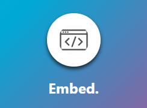
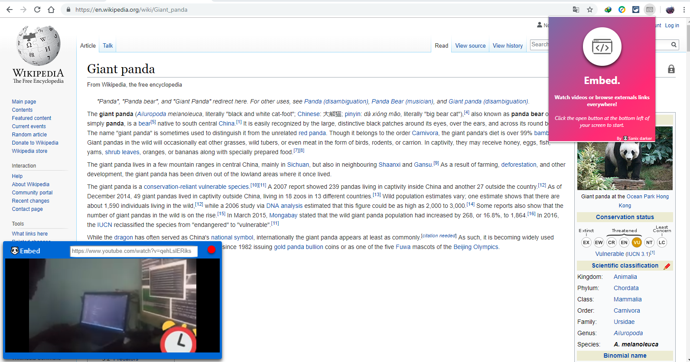

# Embed.

A Browser Extension allowing you to watch videos or browse externals links everywhere in your browser!

### Introduction
I do not know if this is a whim or a need that haunts me, because I know I'm not alone sometimes in this situation! Having several tabs open on my browser including youtube for example, it gives me to have to change tabs to have a scene or to pause on a video that is in progress, not just the videos but who never wanted to be both on wikkipedia and see a video on youtube at the same time? And why stop there? Browse other sites or search directly in the same place!

### Features

- Watch videos in every tab on your browser (such as youtube).
- Browser externals link in the same place.
- Do some research, etc.. (bing search engine used here).
- light, Resizable, Dragable box.

### How it's works

- When a link is given to Embed, it generate a clone of the website you want to access.
- Some WebSite blocks that, so don't be surprise to get an empty preview.
- For Youtube, it's generate an embed video.
- When a text is given, the text do a simple request to bing.

### How to use it

> See the <a href="https://youtu.be/OTYhsvwlsmc" target="_blank">INSTALLATION VIDEO</a>
> And <a href="https://youtu.be/d0GykE_UcN4" target="_blank">HOW TO USE EMBED</a>

* Integrate the Extension in your browser see how to do here (<a href="">Integration demo</a>) the extension is not yet on a store so....
* A button will automatically appear on each webpage you browse after a reload, at the bottom-left.
* Hit the "Open Embed" button.
* Get a link or a text you want to search, paste it in the link input.
* Press Enter and "Embed" will handle all.

### Rendering

### TODO (for potentials contributors)

- [ ] Manage playlist on youtube list.
- [ ] Hndle more website by passing the SAME_ORIGIN restriction.
- [ ] Synchronize Embe on each tab.
- [ ] Open multiple Embed boxes or just works with tabs.
- [ ] Been able to launch Embed when Chrome is close and use it everywhere on the PC.
- [ ] Add a instant Chat for a specific link/video for all user using Embed at the same time.

### Author

- [Sanix darker](https://github.com/Sanix-Darker)

### LICENSE:

[MIT License](https://github.com/Sanix-Darker/embed/blob/master/LICENSE)